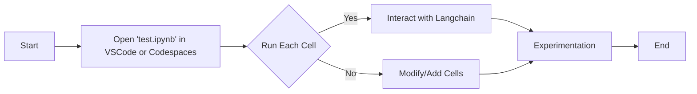

# Devcontainer Boilerplate for Jupyter, Poetry, and Langchain

This repository serves as a boilerplate to illustrate how to use Langchain with Poetry for dependency management in a containerized development environment. It's designed to be run in Visual Studio Code (VSCode) and GitHub Codespaces.

## Getting Started

### Running in VSCode

1. **Prerequisites**: Ensure you have [Docker](https://www.docker.com/products/docker-desktop) installed and running on your system. Also, install [Visual Studio Code](https://code.visualstudio.com/) with the [Remote - Containers](https://marketplace.visualstudio.com/items?itemName=ms-vscode-remote.remote-containers) extension.

2. **Open in Container**: Clone this repository and open it in VSCode. VSCode will prompt you to reopen the folder in a container. Select 'Reopen in Container' to start the containerized environment.

3. **Access Jupyter Notebook**: Once the container is running, open the 'test.ipynb' notebook in VSCode to interact with Langchain using Jupyter.

### Running in GitHub Codespaces

1. **Setup Codespaces**: Navigate to the GitHub repository and click on the 'Code' button. Select 'Open with Codespaces' and then 'New codespace'.

2. **Access Jupyter Notebook**: Once the codespace is ready, you can access the 'test.ipynb' notebook within the codespace environment to start working with Langchain.

## Executing 'test.ipynb'

To execute the 'test.ipynb' Jupyter notebook, follow these steps:

1. Open the notebook in your development environment (VSCode or Codespaces).
2. Run each cell in the notebook to interact with Langchain functionalities.
3. Modify or add new cells as needed for your experimentation.

## Flowchart for Executing 'test.ipynb'

Below is a flowchart illustrating the steps to execute the 'test.ipynb' notebook:

## License

This project is licensed under the [MIT License](LICENSE).
